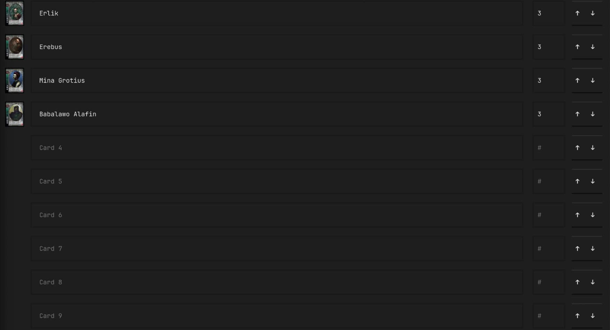
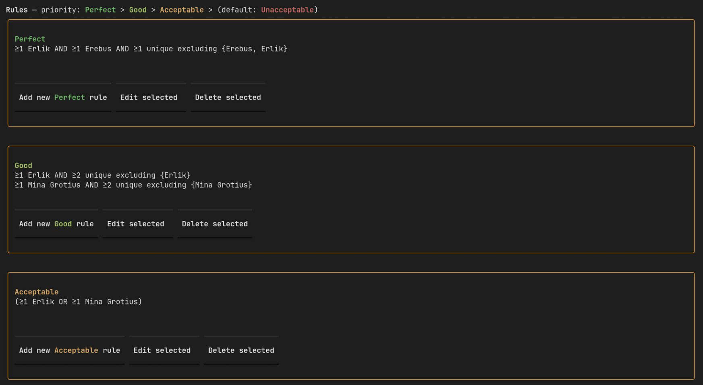
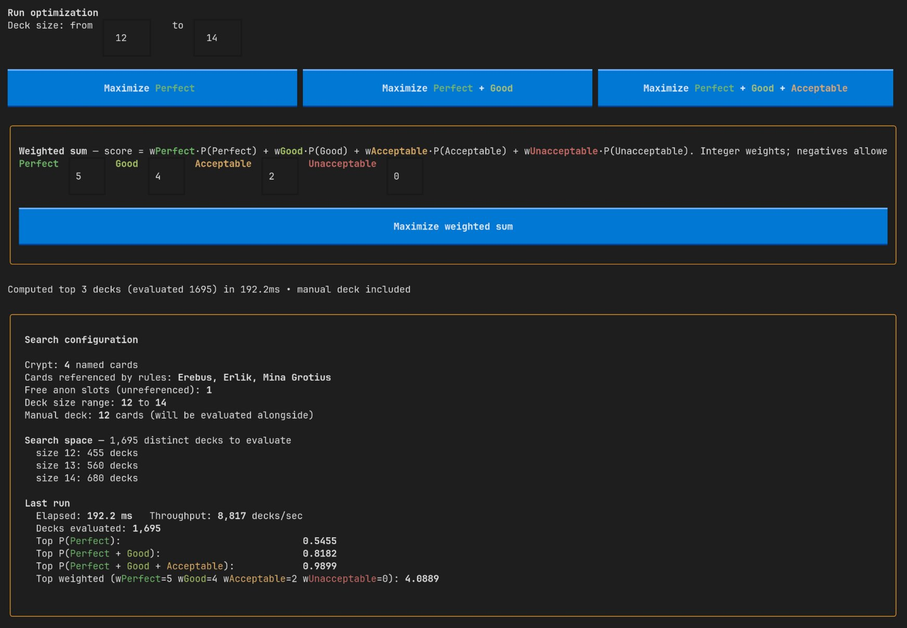
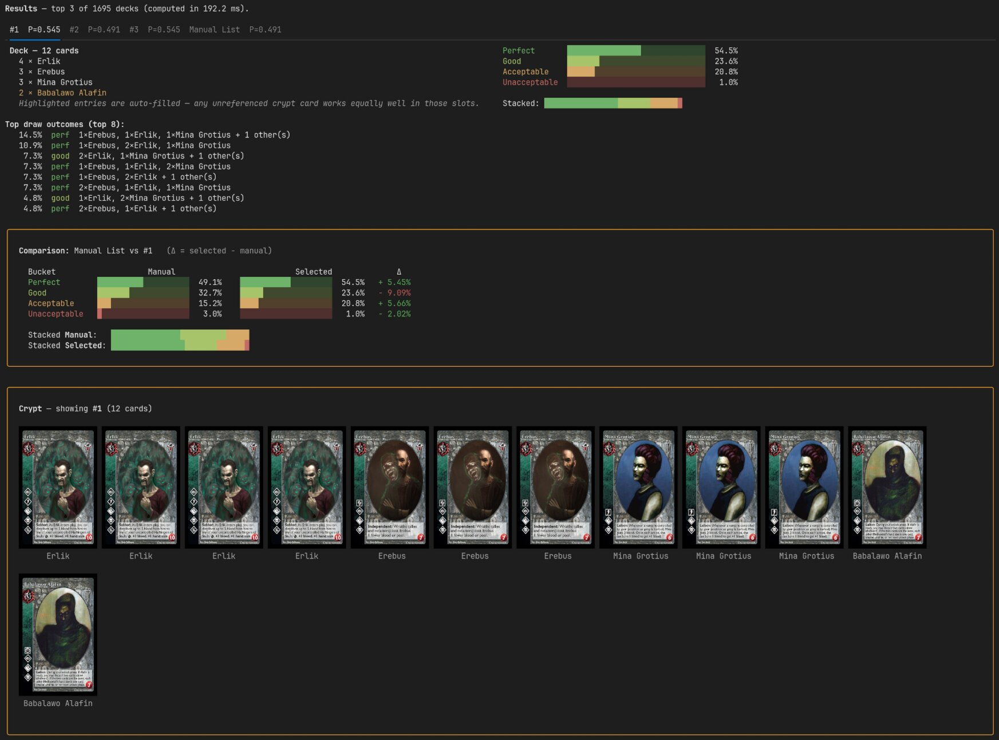
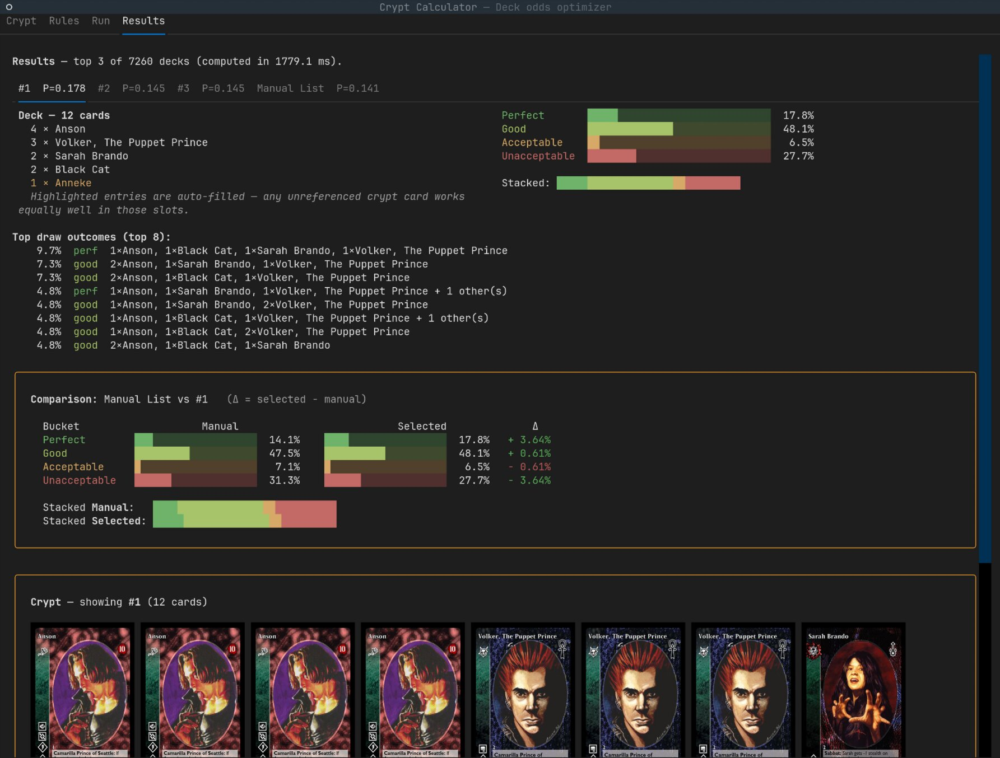

# Crypt Calculator

A terminal UI for optimising the opening opening 4 card crypt in the game Vampire the Eternal Struggle.
You describe your crypt deck and the rules that decide whether a hand is
*perfect / good / acceptable / unacceptable*, and the optimiser searches
every legal deck for the one with the best odds.

## What it does

- **Probability engine** — exact enumeration of every 4-card hand from any
  deck composition, classified into outcome buckets by your rules.
- **Optimiser** — searches over deck size and composition for the best
  decks under one of four objectives (max P, max P∪G, max P∪G∪A, or a
  weighted sum). Returns the top-3 results so you can compare them.
- **Manual deck** — enter your own counts on the Crypt tab and the tool
  evaluates them alongside the optimiser's picks, with a side-by-side
  comparison panel.
- **Card art** — thumbnails next to each crypt entry and full art for the
  selected deck, fetched lazily from [krcg.org][krcg] and cached locally.

[krcg]: https://static.krcg.org

## Screenshots

The tool walks you through four tabs:

**1. Crypt** — list up to ten card names and (optionally) set a count
per card to define your manual deck for comparison.



**2. Rules** — author *perfect*, *good*, and *acceptable* rules.
Anything that doesn't match falls into the implicit *unacceptable*
bucket.



**3. Run** — pick deck-size bounds and an objective, then start the
optimiser.



**4. Results** — top-3 decks, draw-outcome breakdown, a side-by-side
comparison against your manual deck, and card art for the selected
deck.



A worked example using the bundled *Anson* crypt:



## Install

Uses [uv](https://docs.astral.sh/uv/) for environment management; install
that first if you don't have it.

```sh
git clone https://github.com/NicklasLallo/crypt-calculator.git
cd crypt-calculator
uv sync
uv run crypt-calculator
```

Requires Python 3.12+. Card art rendering uses
[textual-image](https://github.com/lnqs/textual-image); your terminal
needs to support either the [Kitty graphics protocol][tgp] or
[Sixel][sixel] for actual images (Kitty, WezTerm, recent Konsole,
foot, ghostty). Other terminals fall back to a Unicode half-cell preview.

**Running inside tmux / zellij / screen?** The auto-probe sees the
multiplexer's emulated terminal — which almost always advertises sixel
support without actually forwarding graphics escapes to the host
terminal — so the app falls back to half-cell rendering automatically
when `$TMUX`, `$ZELLIJ`, or `$STY` is set. Set
`CRYPT_CALCULATOR_RENDERER=auto` to opt back into auto-detection if
your multiplexer is configured to pass graphics through.

If auto-detection still picks the wrong renderer for your terminal,
force one explicitly with the env var:

```sh
CRYPT_CALCULATOR_RENDERER=halfcell uv run crypt-calculator
```

Accepted values: `auto`, `tgp` / `kitty`, `sixel`, `halfcell`,
`unicode`.

[tgp]: https://sw.kovidgoyal.net/kitty/graphics-protocol/
[sixel]: https://en.wikipedia.org/wiki/Sixel

## Examples

Bundled with the package:

- `Anson.{crypt,rules}.yaml`
- `Nehemiah.{crypt,rules}.yaml`
- `unnamed.{crypt,rules}.yaml`

After running **Install examples** they land in
`~/.local/share/crypt-calculator/` and are pickable from the Load
dialogs.

## File locations

Saved crypts and rule-sets, the first-run config flag, and the
card-art cache are resolved via
[platformdirs](https://github.com/platformdirs/platformdirs) so they
land in the native location on every platform. `XDG_DATA_HOME` /
`XDG_CONFIG_HOME` / `XDG_CACHE_HOME` are honoured on Linux and BSD.

| | data | config | cache |
|---|---|---|---|
| Linux/BSD | `~/.local/share/crypt-calculator` | `~/.config/crypt-calculator` | `~/.cache/crypt-calculator/cards` |
| macOS | `~/Library/Application Support/crypt-calculator` | `~/Library/Preferences/crypt-calculator` | `~/Library/Caches/crypt-calculator/cards` |
| Windows | `%LOCALAPPDATA%\crypt-calculator` | `%LOCALAPPDATA%\crypt-calculator` | `%LOCALAPPDATA%\crypt-calculator\Cache\cards` |

## License

[MIT](LICENSE).
